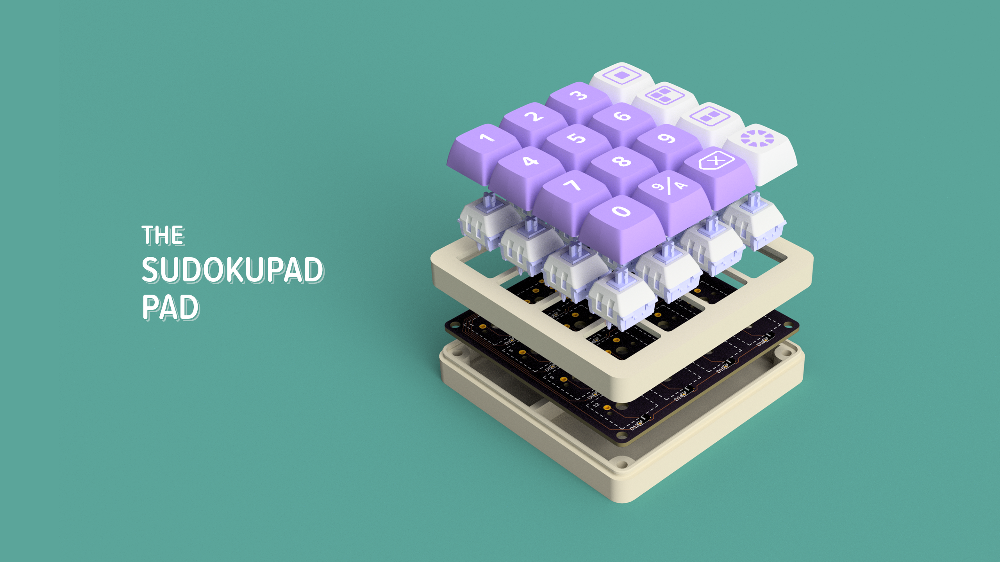

The SudokuPad Pad is a custom peripheral for [Sven Neumann’s SudokuPad](https://svencodes.com). For more [background information](https://scottmadethis.net/interactive/sudokupadpad/) see the project page.

## Making Your Own

Making your own SudokuPad Pad requires some basic soldering and 3d printing skills, as well as a small list of parts.

### Parts List

* 3D printed enclosure and keys in the CAD directory (see below).
* The custom circuit board in PCB (see below).
* A [Seeed Studio XIAO RP2040](https://www.seeedstudio.com/XIAO-RP2040-v1-0-p-5026.html) dev board (pre-soldered saves a step).
* 16 Cherry MX compatible keycaps of your choice ([example](https://www.adafruit.com/product/4955)).
* 16 1N4148 SMT SOD-123 diodes of your choice ([example](https://www.adafruit.com/product/5099)).

### 3D Printing

* The top and bottom parts of the enclosure should be very straightforward prints.
* The keycaps are a bit more complicated and are intended for a two-color printing with a .2mm nozzle.
* As an alternative to printing the keycaps, inexpensive blank white and purple keycaps are widely available.

### Custom PCB

* The Gerber export in the PCB directory can be uploaded to a service like [JLCPCB](https://jlcpcb.com) or [PCBWAY](https://www.pcbway.com) and purchased with more or less default settings.
* A stencil can be helpful, but the diodes are large enough to be soldered by hand.

## Soldering

The order of operations is slightly fussy because of the dual sided solder. My recommendation is:

1. Solder the diodes while everything is still flat and accessible.
2. Solder switch number 2.
3. Seat the Xiao and solder the headers in place on both sides of that switch.
4. Solder the remaining switches.

## Assembly

1. Place the PCB in the bottom half of the enclosure, aligning the USB-C port, and snap together.
2. Place the keycaps.

## Programming

1. Install the Arduino IDE.
2. See [Seeed Studio XIAO RP2040 with Arduino](https://wiki.seeedstudio.com/XIAO-RP2040-with-Arduino/) for IDE setup. 
3. Use the Arduino IDE to open Arduino/SudokuPadPad and write the sketch to the Xiao.

